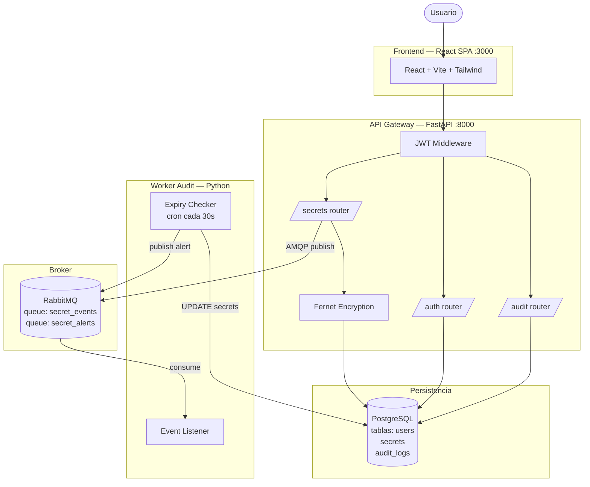
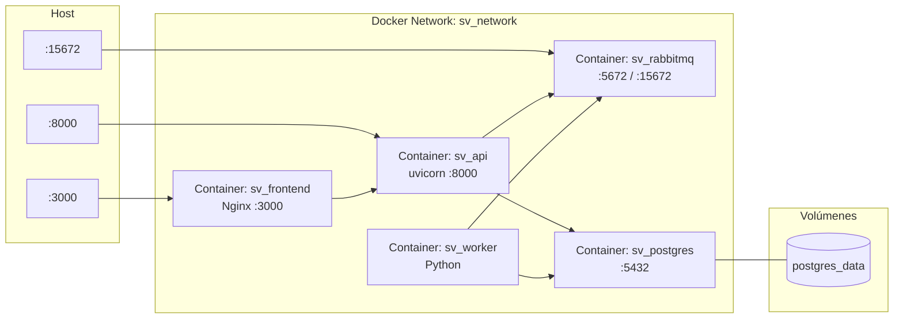
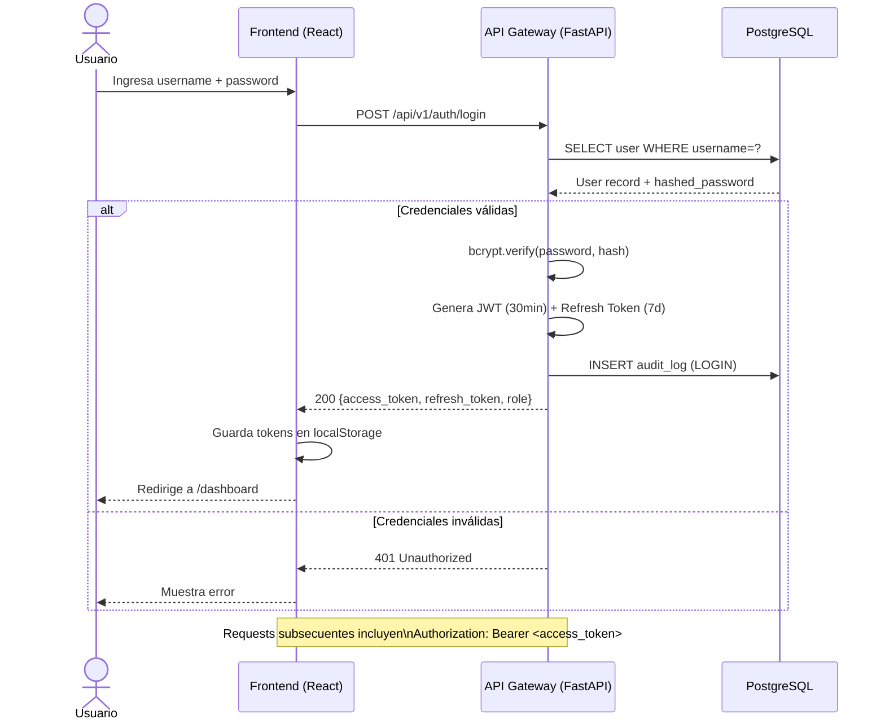
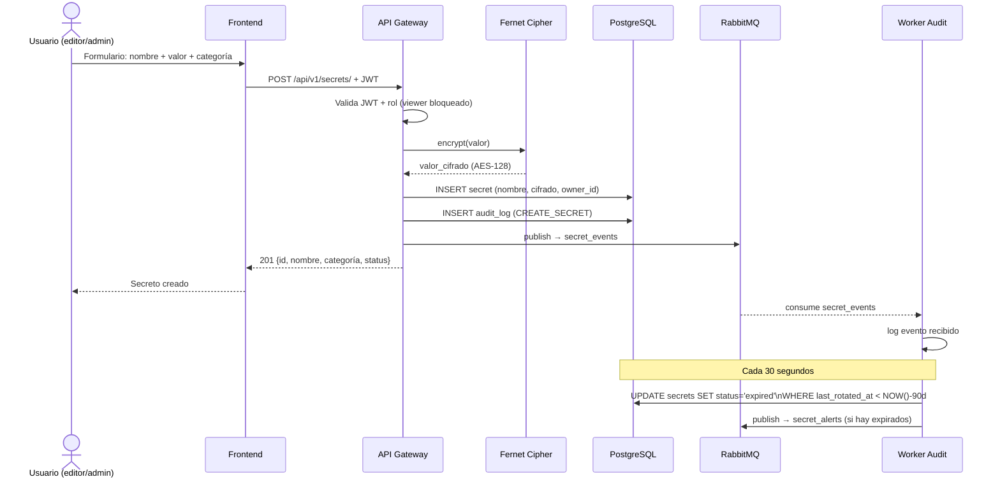
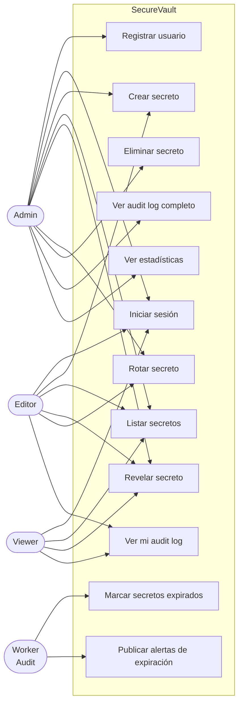
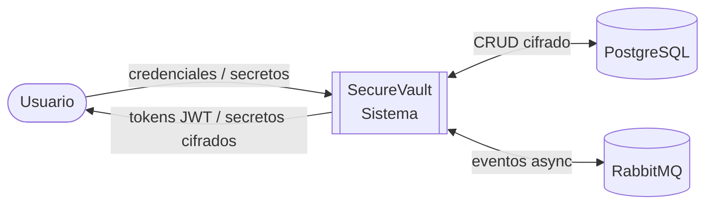
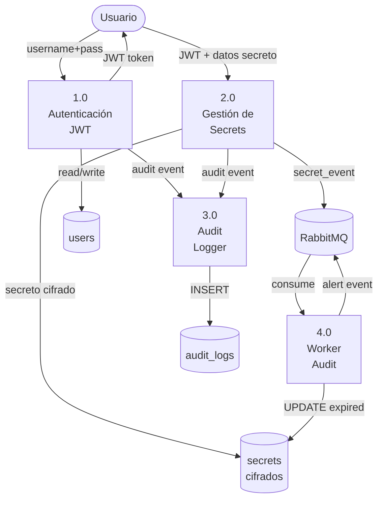
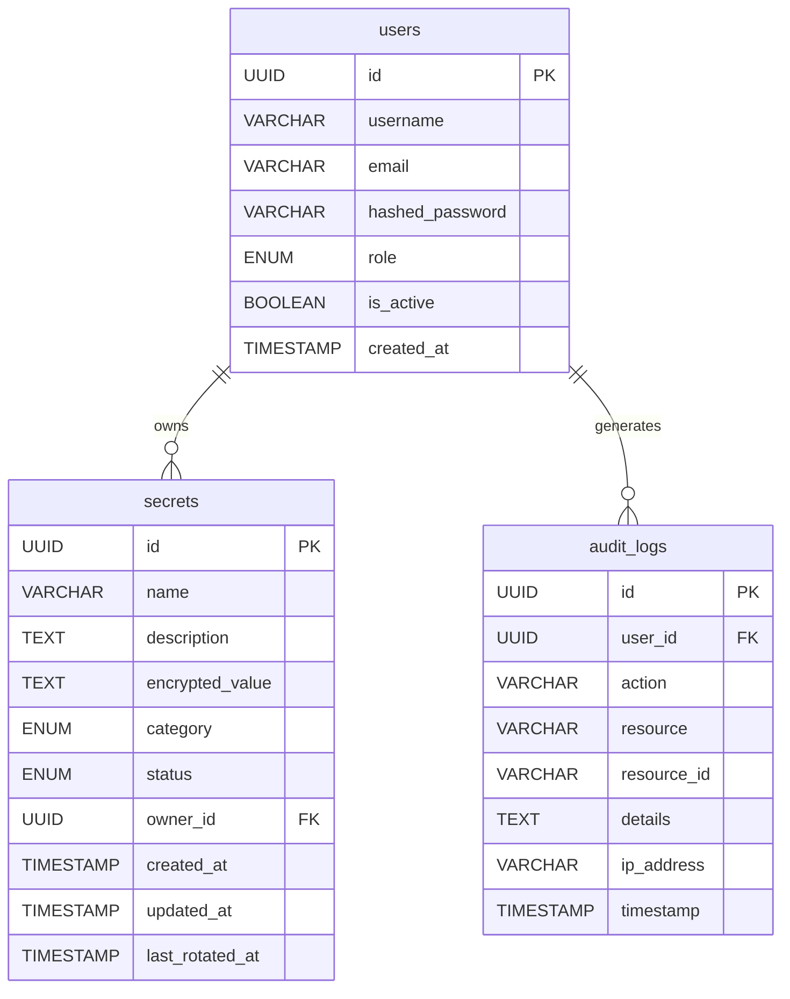

# Manual de Arquitectura — SecureVault

## 1. Descripción General

SecureVault implementa una **arquitectura de microservicios** donde cada componente tiene una responsabilidad única y se comunica a través de interfaces bien definidas: HTTP/REST para comunicación sincrónica y AMQP (RabbitMQ) para comunicación asíncrona.

### Principios de diseño
- **Separación de responsabilidades**: cada servicio hace una sola cosa bien
- **Comunicación asíncrona**: el worker no bloquea al API gateway
- **Cifrado en reposo**: los valores de los secretos se cifran con Fernet (AES-128-CBC) antes de persistirse
- **Principio de mínimo privilegio**: contenedores corren como usuario no-root; roles granulares en la API

---

## 2. Diagrama de Componentes

---

## 3. Diagrama de Despliegue

---

## 4. Diagrama de Secuencia — Autenticación JWT

---

## 5. Diagrama de Secuencia — Almacenar y Rotar Secreto

---

## 6. Diagrama de Casos de Uso

---

## 7. DFD Nivel 0 — Vista General

---

## 8. DFD Nivel 1 — Flujos Internos

---

## 9. Modelo de Datos

